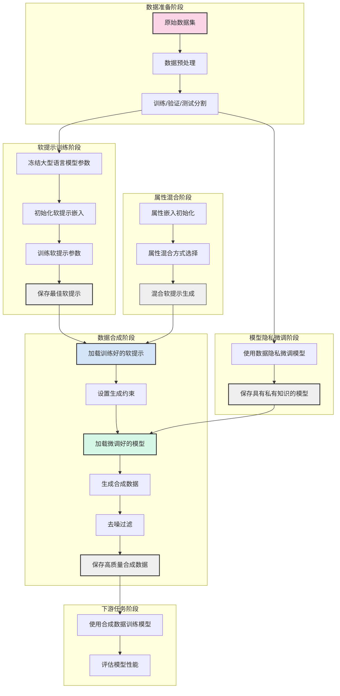

# MSP项目整体框架

上图展示了优化后MSP项目的整体框架，包括7个主要阶段：

1. **数据准备阶段**：处理原始数据集并进行分割
2. **软提示训练阶段**：冻结大型语言模型参数，只训练软提示嵌入
3. **属性混合阶段**：初始化和混合不同属性的嵌入
4. **模型微调阶段**：使用dp-transformer对模型进行训练
5. **数据合成阶段**：使用训练好的软提示和属性混合控制微调好的模型生成数据
6. **数据过滤阶段**：对合成数据进行去噪过滤，提高合成数据质量
7. **下游任务阶段**：使用合成数据训练下游任务模型并评估性能

这个框架展示了新方法的核心优势：使用隐私微调后的模型生成数据而不依赖模型的少样本学习能力生成数据，可以生成更高质量的数据；通过软提示和属性混合，实现可控的数据生成；通过数据过滤，提高合成数据的质量，为下游任务提供高质量的训练数据。 